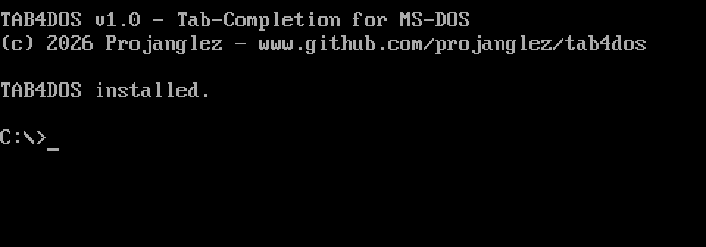

# TAB4DOS

A small resident utility (TSR) for MS-DOS that 
adds **bash-style TAB completion**, **command history**, and **command-line editing** to the 
standard `COMMAND.COM` prompt.

It hooks `INT 21h / AH=0Ah` (buffered line input) and replaces COMMAND.COM's
line editor with its own, while leaving everything else untouched.



## Features

- **TAB / Shift+TAB** — complete and cycle matches (forward / backward) for
  files, directories, path fragments, DOS internal commands, and executables
  found on `PATH`.
- **Up / Down** — browse command history (64 entries), replaces DOSKEY
- **Line editing** — Left/Right, Home/End, Del, Ins (insert/overwrite),
  Ctrl+Left/Ctrl+Right (jump word), ESC (clear line).
- **Small footprint** — ~9 KB resident. The command list and the history ring
  are kept in small files (`TAB4DOS.IDX` / `TAB4DOS.HST`) next to the EXE (or in
  `%TEMP%` with `/usetemp`), not in resident memory; with SmartDrive these
  reads/writes are effectively RAM-speed.

## Requirements

- **CPU:** Intel 8086/8088 or later. The binary is pure 16-bit real-mode code
  with no 386- or 286-specific instructions.
- **OS:** MS-DOS 3.0 or later. It uses DOS 2.0+ services (file handles,
  FindFirst/Next, environment, get/set interrupt vector, TSR) plus the program
  path in the environment block (DOS 3.0+) to find its own directory. Developed
  and tested on MS-DOS 6.22.
- **Files location:** by default `TAB4DOS.IDX` / `TAB4DOS.HST` are written next
  to `tab4dos.exe`. With `/usetemp` they go to `%TEMP%` (or `%TMP%`); if neither
  variable is set, TAB4DOS prints an error and does not install.
- **Optional:** SmartDrive (`SMARTDRV`) makes the per-keystroke index/history
  file access RAM-fast.

## Usage

```
TAB4DOS          Install the TSR (shows a banner)
TAB4DOS /s       Install silently (no output)
TAB4DOS /u       Uninstall and free the resident memory
TAB4DOS /h       Show help
TAB4DOS /usetemp Store index/history in %TEMP% (default: program directory)
```

After installing, just type at the DOS prompt and use the keys above.

## Prior art

Adding history and filename completion to the bare `COMMAND.COM` prompt is an
old idea, and TAB4DOS stands on the shoulders of some classics:

- **DOSKEY** (Microsoft) — the standard TSR that added command history and
  macros, but no filename completion.
- **Enhanced DOSKEY** (Paul Houle) — a drop-in DOSKEY replacement that adds
  Tab auto-completion.
- **4DOS / NDOS** (JP Software) — full `COMMAND.COM` replacements with
  completion and rich line editing (the "4DOS-style" cycling that inspired the
  TAB behaviour here).
- Older editors such as **CED**, **ANARKEY**, **DOSEDIT** and **CMDEDIT**.

TAB4DOS aims for a single, tiny (~9 KB) TSR that combines bash-style TAB
completion, history, and full line editing, while keeping COMMAND.COM itself
in place — and keeps its data out of resident memory by offloading the
command index and history ring to small files.

## Build

Built with **Open Watcom 16-bit (real mode)** — not `wcl386`; a TSR runs in real
mode.

1. Install Open Watcom (the build expects it under `C:\WATCOM`).
2. From a `CMD` prompt, run:

   ```
   build.bat
   ```

   Output: `tab4dos.exe`. The script compiles with `wcc -bt=dos -ms -os -s -zq`
   (`-s` is mandatory — it disables Watcom's `__STK` stack checks, which would
   falsely fire on the foreign stack a TSR runs on) and links with
   `wlink @tab4dos.lnk`.

## Notes

- Test on **real DOS hardware** (or a faithful emulator). DOSBox ships its own
  built-in TAB completion that overrides this tool, so results there are not
  meaningful.
- This software was developed with the help of an AI coding assistant (Claude Code).

## Contributing

Bug reports and ideas are welcome — please open an
[issue](https://github.com/Projanglez/TAB4DOS/issues). Since this is a real-mode
DOS TSR, see [CHANGELOG.md](CHANGELOG.md) for the version history and the build
notes above before sending a pull request.

## License

MIT — see [LICENSE](LICENSE).

TAB4DOS is free and donationware: If you like it, you can
leave a tip at [liberapay.com/Projanglez](https://liberapay.com/Projanglez).
Entirely optional — the tool is and stays fully functional without it.

Copyright (c) 2026 Projanglez
